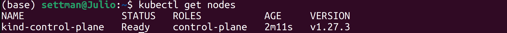
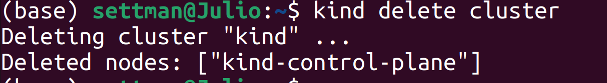
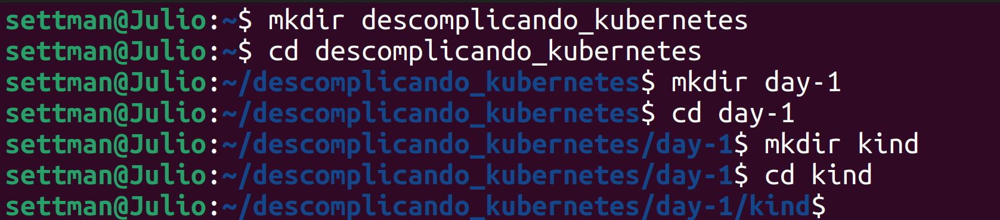
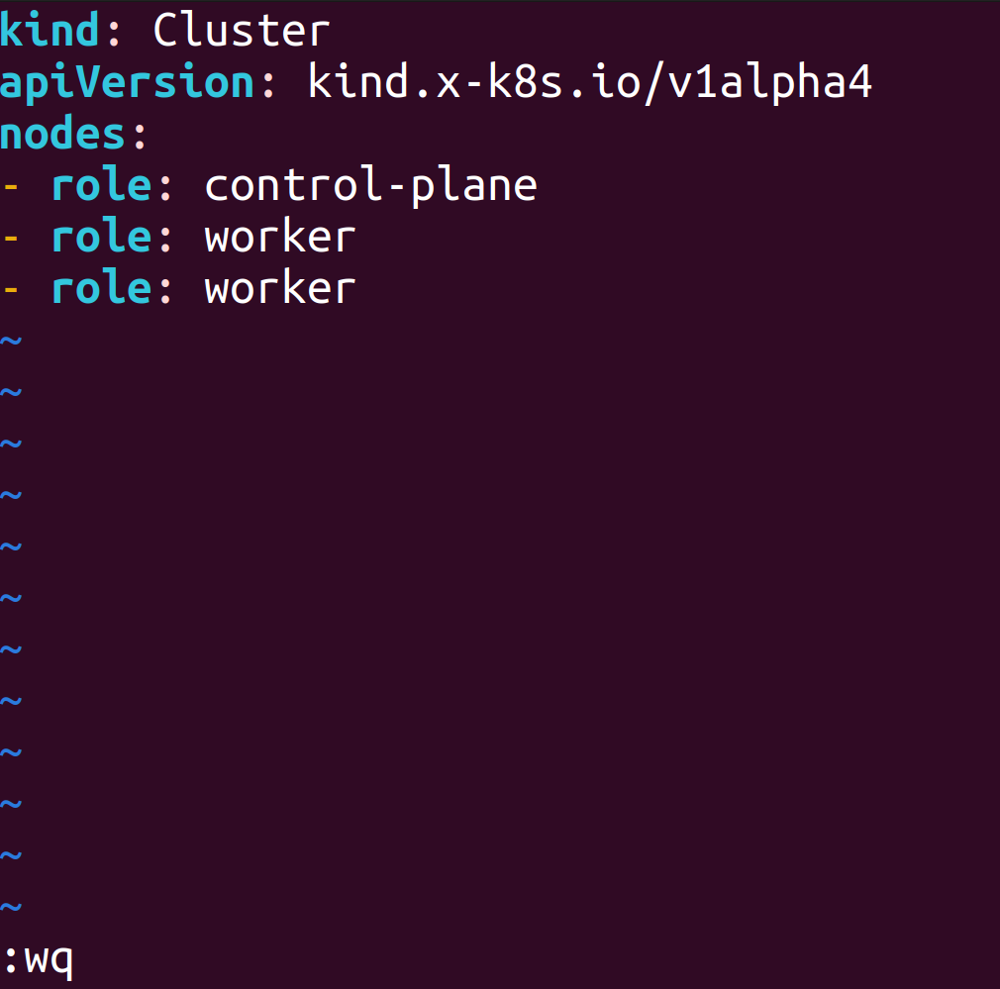
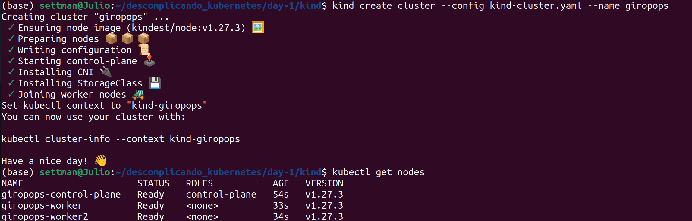
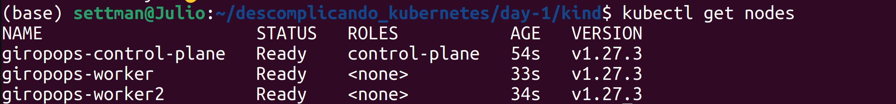

# Day-1: Entendendo o que são containers e o Kubernetes

## Este registro tem como base lhe ensinar o básico de Kubernetes e sua instalação em Linux

 O foco do dia 1 é terminar entendo o básico de container e  os principais elementos do Kubernetes. 

 Você terá a ideia de como criar um pod Kubernetes, como ver ele em execução, além disso, a customização do shell para maior facilidade. 

## O que é um container?

 Mas continuemos na definição de container. Container nada mais é do que rodar sua aplicação de forma isolada da máquina onde ela está rodando. Ele inclui tudo o que é necessário para executar um aplicativo, incluindo o código, as bibliotecas e as dependências. 
O executáevel roda isolado do sistema operacional hospedeiro. Então, ela não sofre influência de outros processos.

 Quando é necessário realizar o isolamento de recursos, por exemplo, memória e CPU, é necessário que o Kernel tenha essa habilidade de produzir essa limitação, entra em  ação o cgroup (abreviação de Control Group)

## Compreendo o conceito de containers.

 Se pensarmos em transporte de cargas, container foi uma revolução nessa área, pois antes deles o tempo de carregar e descarregar um navio era gigantesco e o trabaslho era feito manualmente. Sem contar perdas (devido a quebras ou deterioração), desvio e outros problemas.

 Com a chega dos containers foi possível transportar mercadorias de uma forma segura, de fácil manipulação e com pouco, ou nenhum, trabalho braçal no carregamento ou descarregamento . É justamente isso que o container tenta fazer com os nossos softwares. 

## O que é um container engine?

 É o responsável por fazer que o container tenha todo o ambiente (rede, storage, saúde do container) para uma boa execução do próprio container, ou seja, ele torna possível a criação e execução de containers de maneira eficiente e consistente.

## O que é um container runtime? 

 Principal função do container ruitime, é responsável por executar os containers nos nós, ou seja, garantir que o container esteja em execução. 

 A funcionalidade é garartir o isolamento correto para que as operações de baixo nível necessárias para criar e gerenciar containers, como criação, inicialização, parada e exclusão de containers.

 Existem vários tipos de containers runtimes:

- **Low-level:** são os container runtime executados diretamento pelo Kernel, ou seja, baixo nível.

- **High-level:** não são executadas diretamente com Kernel, ou seja, ele precisa do container engine para que funcione. Eles fornecem uma interface mais amigável e gerenciam detalhes complexos, como isolamento de recursos e namespaces.

## O que é Kubernetes?

O Kubernetes são orquestradores (gerenciadores) de containers. Logo, você pensará: "Entendi, Kubernetes é responsável por administrar os containers." Caso você pensou isso, acertou!

O Kubernetes, frequentemente abreviado como K8s, é uma plataforma de código aberto para automação, escabilidade, gerenciamento de aplicativos em conteiners. Ele é projetado para faciliar a implantação, escabilidade e o gerenciamento de aplicativos que foram empacotados em conteiner, como os conteiners Docker.

 Ele é software responsável por organizar, orquestrar, controlar, gerenciar os seus containers.

**Um exemplo de funcionamento**

Imagine que sua aplicação que a sua aplicação está rodando 100% em um container, entretanto, você teve um grande volume de acessos e o seu container deu algum problema. Para solucionar, você precisará "subir" o container novamente, tratar manualmente, ou seja, dor de cabeça para todos. Você, seu usuário, seu cliente. 

Então com o Kubernetes eu consigo garantir alta disponibilidade de containers, assim, realizando que a queda de um container não "mate" minha aplicação. 

Quando falamos de Kubernetes, falamos em ter inúmeros containers funcionais em diferentes nós, além disso, ter mais opções, "poderes" para a aplicação em questão, como por exemplo, números de replicas, segurança, balanceamento de carga, perfomace.

### Por que utilizar o Kubernetes?

- Escabilidade 
- Gerencimaneto de implantações
- Alta disponibilidade 
- Portabilidade 
- Ecossistema rico
- Padrão indústria 

## O que são os workers e o control plane do Kubernetes?

**Arquitetura do K8s: Control Plane**

 O Control Plane é o cérebro do Kubernetes. É responsável por tomar decisões sobre a implantação e o gerenciamento de aplicativos, além, de garantir que o estado desejado do sistema seja mantido. 

**Arquitetura do K8s: Workers (Trabalhadores)**

Os Workers, também conhecidos como nodes, são as máquinas onde os containers são executados. Eles são responsáveis por executar as cargas de trabalho de conteiners conforme especificado no Control Plane.

### Quais os componenetes do control plane do Kubernetes?
- **API Server (Kube-apiserver):** 
 Este é o componente central do Control Plane. Ele expõe a API do Kubernetes, que os usuários e os componentes do Kubernetes usam para interagir com o cluster. Quando você executa comandos `kubectl`, eles são enviados para API Server.

- **Etcd:** 
 É um um armazenamento de chave-valor consistente usado para manter o estado de todo o cluster Kubernetes. Todas as informações sobre os objetos Kubernetes, como pods, serviços para garantir a confiabilidade.
- **Controller Manager:** 
 Este componente é responsável pela execução de controladores que regulam o estado do sistema. Os controladores monitoram continuamente o estado atual do cluster e fazem ajuste para garantir que o estado desejado seja mantido. Por exemplo, o controlador de replicação garante que o número desejado de réplicas de um pod esteja sempre em execução.

- **Scheduler:** 
 É responsável por determinar em qual nó (Node) um novo pod deve ser implantado com base em vários fatores, como recursos disponíveis, requesistos de haerdware e políticas de agendamento. Ele ajuda a garantir a distribuição equilibrada de cargas no cluster.

### Quais os componentes do Workers do Kubernetes?

- **Kubelet:** 
 É um agente que é executado em cada Node e é responsável por garantir que os conteiners dentro dos pods estejam em execução em um estado saudável. Ele também relata o status do Node para o Control Plane.

- **Kube Proxy:** 
 É responsável por gerenciar o tráfego de rede para os pods. Ele configura as regras de encaminhamento de tráfego e balanceamento de carga, permitindo a comunicação entre os pods e do mundo exterior para os serviços. 

## Introdução a pods, replicas sets, deployments e service

1. Pods:

    O que são Pods? Um pod é a unidade mais simples no ecossistema do Kubernetes. Ele representa um único processo em um cluster Kubernetes. Um pod pode conter um ou mais containers que compartilham o mesmo espaço de rede, armazenamento e contexto. Os containers em um pod geralmente trabalham juntos para executar uma aplicação específica.

2. ReplicaSets:

    O que são ReplicaSets? Um ReplicaSet é um controlador no Kubernetes que garante que um número especificado de réplicas (ou cópias) de um pod esteja sempre em execução no cluster. Se algum dos pods falhar ou for excluído, o ReplicaSet criará automaticamente um novo para manter o número desejado de réplicas.

3. Deployments:

    O que são Deployments? Um Deployment é um recurso Kubernetes que gerencia a implantação de aplicativos em um cluster. Ele é usado para definir como um aplicativo é implantado, atualizado e escalado. Um Deployment pode controlar um ou vários ReplicaSets, permitindo a implantação de novas versões de aplicativos com facilidade.

4. Services:

    O que são Services? Um Service é um recurso Kubernetes que define um conjunto lógico de pods e uma política de acesso a esses pods. Ele atua como um balanceador de carga interno para os pods, fornecendo um ponto de acesso único para os clientes acessarem os pods, independentemente de quais nodes do cluster eles estejam em execução. Existem diferentes tipos de serviços, incluindo Service de ClusterIP, NodePort e LoadBalancer.

**Resumo:** 

**Pods** são a menor unidade em Kubernetes, contendo um ou mais containers. 

**ReplicaSets** garantem que um número específico de pods esteja em execução. 

**Deployments** gerenciam a implantação e atualização de aplicativos.

**Services** fornecem acesso a um conjunto de pods de maneira uniforme.

## Entendendo e instalando o kubectl para Linux 

 Este é o link da documentação [kubectl] (https://kubernetes.io/docs/tasks/tools/install-kubectl-linux/). 

A instalação é bem simples, é um binário em Go. 

**Passo 1:** 

 Copie e cole o binário abaixo em seu terminal.

`curl -LO "https://dl.k8s.io/release/$(curl -L -s https://dl.k8s.io/release/stable.txt)/bin/linux/amd64/kubectl"`

**Passo 2:**

 Dê a permissão de execução. 
Utilize os seguintes comandos:

 `chmod +x kubectl`

 `ls -lha`

 Pronto! Você tem a permissão de execução.

**Passo 3:**

 Mova para o local correto com o seguinte comando:

`mv kubectl /usr/local/bin/`

## Criando o nosso primeiro cluster com kind

**Passo 1: Instale o Kind**

 Instale o Kind em seu sistema Linux. Você pode baixar o Kind no GitHub ou usar um gerenciador de pacotes específico para o seu sistema. Por exemplo, no Ubuntu, você pode usar o curl para baixar o Kind e instalá-lo da seguinte maneira:

`curl -Lo ./kind https://kind.sigs.k8s.io/dl/v0.20.0/kind-linux-amd64`

`chmod +x ./kind`

`mv ./kind /usr/local/bin/kind`

**Passo 2: Instale o Docker** 

 Se o Docker ainda não estiver instalado em seu sistema, siga as instruções de instalação para o seu sistema específico. Você pode encontrar as instruções de instalação do Docker no site oficial do[Docker] (https://docs.docker.com/get-docker/).

**Passo 3:**

 Tudo configurado agora é só rodar:

`kind create cluster`

 Pronto! Só você utilizar o comando 

`kubectl get nodes`

 Para deleter o seu cluster, use o comando:

`kind delete cluster`

**Pronto! Você sabe tudo que é necessário para realizar uma criação de cluster utilizando kind.**

## Simular um Kubernetes multi nodes

 Você precisará seguir o passo a passo abaixo:

1. Abra seu terminal

2. Crie uma pasta: `mkdir descomplicando_kubernetes`

3. Entre na pasta criada: `cd descomplicando_kubernetes`

4. Crie o diretório: `mkdir day-1`

5. Entre no diretório criado: `cd day-1`

6. Crie um novo diretório: `mkdir kind`

7. Entre nele: `cd kind`

8. Realize a criação de um arquivo .yaml com o seguinte comando: `vim kind-cluster.yaml`

9. Você passará o que está descrito no print abaixo:

10. Para salvar `ESC :wq + ENTER`

11. Realize a criação do cluster com kind `kind create cluster --config kind-cluster.yaml --name giropops`

12. Depois de criado é só utilizar o comando `kubectl get nodes` 

 Pronto, você criou um cluster vários nodes utilizando kind.

