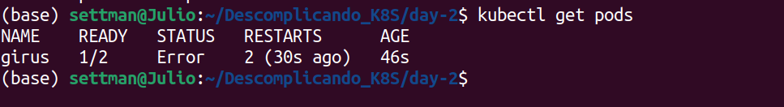

# Day-2: Foco em pods

## O que é um Pod?

 Em Kubernetes, um "pod" é a menor unidade computacional que você pode criar e implantar. Um pod pode conter um ou mais conteiners, compartilhando o mesmo espaço de rede, armazenamento e outras especificações.

## É normal e comum um pod ter vários containers? 

 Sim! É normal e comum ter um pod com vários containers em Kubernetes. A capacidade de ter múltiplos conteiners em um único pod é uma das características poderosas do Kubernetes e é frequentemente utilizada para atender a várias necessidades em um ambiente de implantação de aplicativos.

 Os conteiners dentro de um pod compartilham o mesmo namespace de rede, o que significa que eles podem se comunicar facilmente uns com os outros usando "localhost". Além disso, eles podem compartilhar volumes, que podem ser usados para compartilhar dados.

Um exemplo em que você pode utilizar vários conteiners dentro de um único pod.

1. **Comunicação e Colaboração:** Você pode ter conteinerss que precisam colaborar entre si. Por exemplo, um conteiner de aplicativo principal pode estar acoplado a um conteiner de sidecar que lida com funções de registro, monitoramento ou envio de logs.

## Criação e exclusão de pods

 Para realizar a criação de um pod é bem simples. 
Utilize o seguinte comando:

`kubectl run NOME-DO-POD --image nginx --port 80 `

 Detalhe, foi utilizada a porta 80, pois é um web service. Você pode ajustar de acordo com a sua necessidade. 

 Para a exclusão, utilize:

`kubectl delete pods NOME-DOS-SEU-POD`

 Neste caso foi:

`kubectl delete pods strigus`

 Para ver o pod criado, utilize:

`kubectl get pods`

 Dale! Seu pod tá vivão! 

## kubectl get pods e o kubectl describe pods

 São dois comandos no Kubernetes que permitem listar e obter informações detalhadas sobre os pods em um cluster.

1. Kubectl get pods:

 Este comando `kubectl get pods` é utilizado para listar todos os pods no namespace atual ou em um namespace específico. Ele fornece uma visão geral de todos os pods.

Exemplo de uso:

`kubectl get pods`

2. Kubectl describe pods

 O comando `kubectl describe pod NOME-DO-SEU-POD` fornece informações detalhadas sobre um pod específico. 

 Exemplo de uso:

`kubectl describe pod strigus`

 Os comandos: `kubectl get pods` fornece uma visão geral rápida dos pods em execução, enquanto `kubectl describe pod NOME-DO-POD` permite uma investigação mais profunda quando é necessário diagnosticar problemas ou entender melhor o estado de um pod específico.

## Criando nosso primeiro pod multicontainer utilizando um manifesto

 Para criar um pod multicontainer utilizando um manifesto no Kubernetes, você precisará criar um arquivo YAML que descreve a configuração do pod com múltiplos conteiners. 

 Abaixo, vou fornecer um exemplo simples de como criar um pod multicontainer com dois conteineres, um baseado no Nginx e outro baseado no Alpine, usando um arquivo de manifesto YAML:
Usando o kubectl para criar um arquivo de manifesto YAML que descreve um pod no Kubernetes. 

 Vou explicar cada parte do comando:

`kubectl run girus --image alpine --dry-run=client -o yaml`

1. kubectl run girus --image alpine: Este comando cria um novo recurso chamado "girus" (que é o nome do pod) usando a imagem "alpine". Isso cria um pod simples com um único conteiner baseado na imagem Alpine.

2. --dry-run=client: Este sinalizador indica ao kubectl para não efetuar nenhuma alteração no cluster, mas apenas gerar o manifesto YAML que seria usado para criar o recurso. É útil quando você deseja apenas gerar o arquivo de configuração sem realmente criar o recurso no cluster.

3. -o yaml: Este sinalizador especifica o formato de saída desejado, que é YAML. Isso faz com que o kubectl gere o manifesto no formato YAML.

`kubectl run girus --image alpine --dry-run=client -o yaml > pod.yaml`

 Agora crie o seu pod utilizando este manifesto:

`kubectl apply -f pod.yaml`

 Pod criado com sucesso!
Mas vale ressaltar que é necessário realizar a troca da imagem para nginx, pois a imagem Alpine não é um serviço.

 Entre no manifesto através do comando: 

`vim pod.yaml`

 Caso você utilize o comando kubectl get pods, sempre você terá esse erro: 

 Então é necessário que você utilize o comando apply.

`kubectl apply -f pod.yaml`

 Pronto! Configurado

 Vamos adicionar uma nova imagem ao pod.yaml

`vim pod.yaml`

 Você enfretará um erro assim que utilizar o comando `kubectl apply -f pod.yaml` Pois estar sendo adicionando um container novo.

 Para resolver este erro, utilize o seguinte comando: 

`kubectl delete -f pod.yaml`

Irá deletar o pod e depois: 

`kubectl apply -f pod.yaml`

 Você vai identificar que existe um "CrashLoopBackOff". Este erro acontece pois o Ubuntu não possui um serviço, para isso, vamos trocar para o httpd, que é um apache.

`vim pod.yaml `

`kubectl delete -f pod.yaml` 

`kubectl apply -f pod.yaml` 

`kubectl get pods`

 Você está vendo que o erro ainda existe. Como sabemos o motivo do erro?

 Simples! Utilize o comando 

`kubectl describe pods girus`

`kubectl logs girus`

 Podemos utilizar outro comando para especificar cada vez mais.

`kubectl logs girus -c apache` 

 Lembrando, o nome apache foi definido no nosso pod.yaml, ou seja, é o nome do nosso container. 

 O erro é na porta 80, pois são dois web services querendo utilizar a porta 80 ao mesmo tempo. 

### Vamos resolver esse problema! 

 Vamos entrar novamente no nosso arquivo pod.yaml através do comando já visto:

`vim pod.yaml`

 E alterar a imagem para busybox e passar alguns argumentos.

 O argumento sleep é um argumento que irá esperar e depois informamos quantos segundos.

 Depois é o mesmo passo a passo. Delete o pod e crie novamente

`kubectl delete -f pod.yaml` 

`kubectl apply -f pod.yaml `

 Com o exemplo acima, fica mais fácil o conceito de pods, que eles utilizam o mesmo namespace, como foi realizada a inserção de mais um conteiner, eles compartilharam o mesmo recurso, como foi o de redes, por isso, tivemos o erro acima. 

 Tá lá! Tudo funcionando certo. Sem problemas. 

## Limitando o consumo de recursos de CPU e memória.

 Como é ensencial que o pod uma imagem, é de suma importância que o mesmo possua limites, pois é graças a isso que você conseguirá realizar o gerenciamento correto do seu cluster. 

**Vamos começar!**

 Faça um cópia do arquivo .yaml com o seguinte comando. 

`cp pod.yaml pod-limitado.yaml`

 Entre no arquivo:

`vim pod-limitado.yaml`

1. **resources:** Isso é uma seção em um manifesto do Kubernetes que permite definir os recursos (CPU e memória) alocados para um contêiner em um pod.

2. **limits:** Esta seção define os limites máximos de recursos que o conteiner pode consumir. No exemplo:
cpu: "0.5": Isso define um limite máximo de CPU de 0.5 unidades. As unidades de CPU são uma representação da capacidade de processamento disponível no cluster Kubernetes. Esse limite significa que o conteiner não pode consumir mais do que 0.5 unidades de CPU, independentemente de quanto poder de processamento esteja disponível no nó em que o pod está sendo executado.

3. **memory:** "128Mi": Isso define um limite máximo de uso de memória de 128 Mebibytes (MiB). Isso significa que o contêiner não pode usar mais de 128 MiB de memória, mesmo que mais memória esteja disponível no nó.

4. **requests:** Esta seção define as solicitações de recursos, ou seja, a quantidade mínima de recursos que o conteiner precisa para ser executado de maneira eficaz. No exemplo: cpu: "0.3": Isso significa que o contêiner requer pelo menos 0.3 unidades de CPU para funcionar corretamente. memory:"64Mi": Isso significa que o conteiner requer pelo menos 64 MiB de memória para funcionar corretamente.

 Para identificarmos para se deu tudo certo basta executar os seguintes comandos:

`kubectl apply -f pod-limitado.yaml`

`kubectl get pods`

 Depois utilize o describe:

`kubectl describe pods giropops`

## Configurando o nosso primeiro volume EmptyDir

 No Kubernetes, um volume EmptyDir é um tipo de volume que é montado no sistema de arquivos do contêiner e compartilhado entre os contêineres no mesmo pod. É um volume temporário que existe apenas enquanto o pod estiver em execução. Assim que o pod for excluído, o conteúdo do volume EmptyDir também é perdido.

 Para configurar um volume EmptyDir em um pod, você precisa definir uma seção volumes no manifesto do pod e, em seguida, montar esse volume em cada contêiner que deseja acessá-lo. Aqui está um exemplo de como fazer isso:

`cp pod-limitado.yaml pod-emptydir.yaml`

`vim pod-emptydir.yaml`

 Passe as seguintes especificações para seu arquivo .yaml.

 Depois é só criar utilizando:

`kubectl apply -f pod-emptydir.yaml`

 Você também pode utilizar o describe para realizar a verificação do mounts.

`kubectl describe pods giropops`

 Para você entrar dentro do bash do pod e verificar o mount.

`kubectl exec -ti giropops -- bash`

`ls`

`mount`

 Pronto! Você verá a montagem dele.

